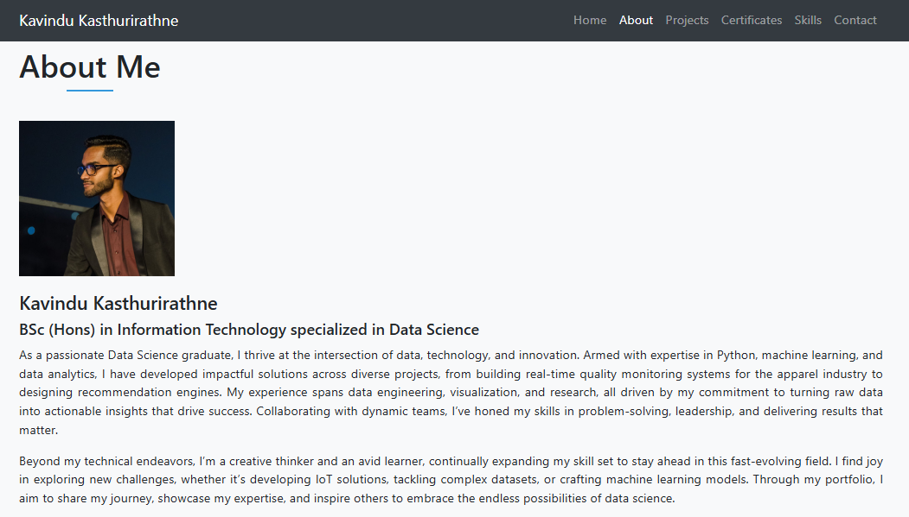

## Kavindu Kasthurirathne
### BSc (Hons) in Information Technology specialized in Data Science

[](https://github.com/KavinduKasthurirathne/portfolio/blob/main/LICENSE)
[]([https://your-portfolio-link.com](https://kavindukasthurirathne.github.io/Portfolio-KavinduKasthurirathne/))

Professional portfolio website showcasing projects, skills, certifications, and professional experience in Data Science and Software Development.



## Features

- Responsive Design
- Project Showcase Section
- Skills Visualization
- Certifications Gallery
- Interactive Contact Section
- Smooth Scroll Navigation
- Scroll Progress Indicator
- Hover Animations
- Bootstrap-powered Layout
- Font Awesome Icons

## Technologies Used

- HTML5
- CSS3 (Custom Properties, Animations)
- JavaScript (Intersection Observer API)
- Bootstrap 4.5
- Font Awesome 5

## Sections

- About Me
- Projects (12 Featured Projects)
- Certifications & Licenses
- Technical Skills
- Contact Information

<hr>
## Installation

1. Clone the repository:
```bash
git clone https://github.com/KavinduKasthurirathne/portfolio.git
```

<hr>
portfolio/
├── index.html
├── styles.css
├── scripts.js
├── images/
│   ├── about/
│   ├── certificates/
│   ├── projects/
│   ├── skills/
│   └── screenshots/
├── icons/
│   ├── github.png
│   └── linkedin.png
└── README.md
